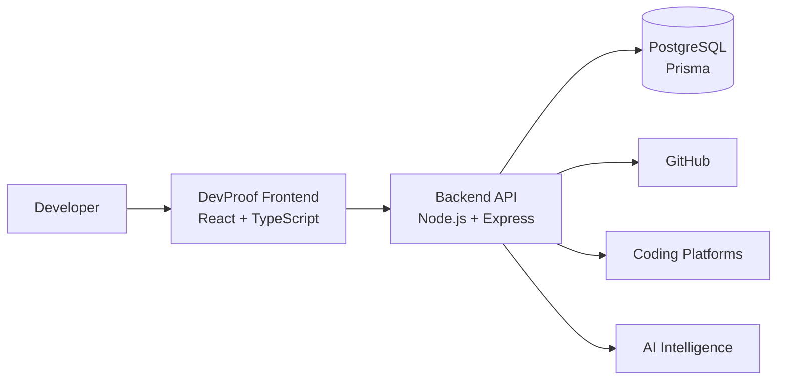

# DevProof 🧠

> **Developer Intelligence & Engineering Evidence Platform**

DevProof is an AI-powered developer intelligence platform designed to transform real engineering activity into structured, evidence-backed professional intelligence.

Instead of relying only on resumes, self-reported skills, or static portfolios, DevProof brings together signals from GitHub, coding platforms, projects, certifications, and development activity to build a continuously evolving picture of a developer's technical capabilities.

**Connect → Analyze → Verify → Improve → Prove**

---

## 🚀 What is DevProof?

A developer's actual engineering ability is distributed across multiple platforms.

GitHub shows code.  
Coding platforms show problem-solving ability.  
Projects demonstrate implementation skills.  
Certifications demonstrate formal learning.  
A resume communicates what the developer claims.

**DevProof brings these signals together and turns them into engineering evidence.**

### Core Intelligence

- 📊 Developer Intelligence
- 💻 Engineering Evidence
- 🧠 AI-powered Insights
- 📈 Growth Analytics
- 🎯 Career Readiness

---

## ✨ Core Features

| Feature | Description |
|---|---|
| 🔐 **Secure Authentication** | Email/password authentication with HTTP-only JWT cookies and GitHub OAuth |
| 🐙 **GitHub Integration** | Connect GitHub and synchronize developer profiles and repositories |
| 🔍 **Repository Intelligence** | Analyze repositories, technologies, activity, and engineering signals |
| 👨‍💻 **Developer 360** | Build a multi-dimensional developer profile from real engineering evidence |
| 🧩 **Skill Intelligence** | Identify technologies and skills supported by actual engineering activity |
| 🧠 **Problem Solving Intelligence** | Aggregate competitive-programming evidence from coding platforms |
| 📈 **Growth Analytics** | Track development activity, technology growth, projects, and engineering progression |
| 🎯 **Career Readiness** | Evaluate readiness for different engineering roles |
| 🤖 **AI Insights** | Generate engineering strengths, risks, recommendations, and development insights |
| 📜 **Credentials & Evidence** | Organize certifications and professional evidence |
| 🔄 **Continuous Sync** | Keep connected engineering data synchronized without manual re-entry |

---

## 🧠 The DevProof Philosophy

Traditional developer profiles answer:

> **"What does this developer say they can do?"**

DevProof aims to answer:

> **"What evidence demonstrates that they can do it?"**

### Traditional Developer Profile

```text
Resume
   ↓
Self-Reported Skills
   ↓
Projects
   ↓
Recruiter Evaluation
```

### DevProof

```text
GitHub
LeetCode
GFG
Projects
Certifications
Coding Activity
Engineering Signals
       ↓
Evidence Engine
       ↓
Developer Intelligence
       ↓
Skills + Strengths + Risks
       ↓
Career Readiness
       ↓
Actionable Recommendations
```

---

## 🐙 GitHub Intelligence

GitHub is one of the primary evidence sources in DevProof.

After connecting a GitHub account, DevProof can synchronize:

- GitHub profile
- Public repositories
- Repository metadata
- Languages
- Topics
- Stars
- Forks
- Watchers
- Open issues
- Repository activity
- Created / updated / pushed timestamps
- Fork and archived status

Repositories are stored with per-user ownership and synchronized safely without creating duplicate records.

### Repository Intelligence

Each repository can become an engineering evidence source.

DevProof can surface:

- Repository quality
- Technology usage
- Engineering activity
- Project maturity
- Repository metadata
- Analysis status
- Development signals

Where analysis has not yet been performed, DevProof explicitly shows **Analysis Pending** rather than fabricating a score.

---

## 👨‍💻 Developer 360

Developer 360 provides a consolidated view of engineering capability.

Instead of looking at individual repositories independently, DevProof combines multiple evidence sources into a broader developer profile.

### Developer 360 can surface

- Technical skills
- Technologies
- Repository activity
- GitHub evidence
- Problem-solving evidence
- Project evidence
- Engineering strengths
- Development risks
- Professional growth

The goal is to create a profile that represents **engineering capability rather than simply listing technologies**.

---

## 📊 Evidence Engine

DevProof organizes developer information into evidence categories.

```text
                    Developer
                        │
           ┌────────────┼────────────┐
           ▼            ▼            ▼
        GitHub        Coding       Projects
           │         Profiles         │
           ▼            ▼             ▼
      Repository     Problem        Project
       Evidence      Solving        Evidence
           │         Evidence         │
           └────────────┼────────────┘
                        ▼
                 Evidence Engine
                        │
           ┌────────────┼────────────┐
           ▼            ▼            ▼
         Skills        Growth       Career
                                    Readiness
                        │
                        ▼
                   AI Insights
```

---

## 💻 Problem Solving Intelligence

DevProof brings competitive-programming activity into the developer evidence model.

Supported platforms can contribute signals such as:

- Problems solved
- Easy / Medium / Hard distribution
- Contest performance
- Rankings
- Coding activity
- Streaks
- Platform-specific statistics

The system normalizes platform-specific data into a common evidence structure.

---

## 📈 Growth Intelligence

Developer growth is not represented by a single number.

DevProof tracks signals such as:

- Repository growth
- Project activity
- Technologies learned
- Skill progression
- Development consistency
- Achievements
- Engineering milestones

The objective is to answer:

> **"Is this developer actually progressing?"**

---

## 🎯 Career Readiness

DevProof translates engineering evidence into role-oriented readiness.

Potential dimensions include:

- Technical Skills
- Projects
- Problem Solving
- Version Control
- Documentation
- Communication
- Role-specific requirements

The system can identify gaps and convert them into actionable development milestones.

---

## 🤖 DevProof Intelligence

The AI layer transforms collected evidence into understandable engineering insights.

### Strength Analysis

Identify areas where the developer demonstrates strong evidence.

### Risk Analysis

Identify gaps such as:

- Limited testing evidence
- Limited backend experience
- Limited cloud exposure
- Low open-source activity

### Engineering Recommendations

Generate actionable next steps such as:

- Improve testing
- Build scalable backend systems
- Strengthen CI/CD
- Learn cloud infrastructure
- Contribute to open source
- Build larger full-stack projects

The AI layer is designed to **interpret evidence, not invent it**.

---

## 🔐 Authentication & Security

DevProof uses a security-first authentication architecture.

### Authentication

- Email/password authentication
- HTTP-only JWT cookies
- GitHub OAuth
- Protected dashboard routes
- Session restoration
- Secure logout

JWT tokens are never stored in `localStorage` or `sessionStorage`.

GitHub access tokens remain server-side and are never exposed to the frontend.

---

## 🏗️ System Architecture



---

## 🛠️ Tech Stack

### Frontend

- React
- TypeScript
- Vite
- Tailwind CSS
- React Router
- Framer Motion
- Lucide Icons

### Backend

- Node.js
- Express.js
- TypeScript
- Prisma
- PostgreSQL
- JWT
- bcrypt
- Zod
- Helmet
- Express Rate Limit

### Integrations

- GitHub OAuth
- GitHub API
- Competitive Programming Platforms

### AI

- LLM-powered engineering analysis
- Structured developer intelligence
- Evidence-based recommendations

---

## 📁 Project Structure

```text
DevProof/
├── Frontend/
│   ├── src/
│   │   ├── components/
│   │   ├── pages/
│   │   ├── layouts/
│   │   ├── context/
│   │   ├── hooks/
│   │   ├── services/
│   │   └── lib/
│   └── package.json
│
├── Backend/
│   ├── prisma/
│   │   ├── schema.prisma
│   │   └── migrations/
│   ├── src/
│   │   ├── controllers/
│   │   ├── routes/
│   │   ├── services/
│   │   ├── middleware/
│   │   ├── config/
│   │   └── utils/
│   ├── test/
│   └── package.json
│
├── README.md
└── package.json
```

---

## ⚙️ Local Development

### Prerequisites

- Node.js
- npm
- Docker Desktop
- Git

### Clone Repository

```bash
git clone https://github.com/IshaanSaxena2005/DevProof.git
cd DevProof
```

### Backend

```bash
cd Backend
npm install
```

Create `Backend/.env`, then start PostgreSQL:

```bash
docker compose up -d
```

Apply Prisma migrations:

```bash
npm run prisma:migrate
```

Start the backend:

```bash
npm run dev
```

Backend:

`http://localhost:5000`

### Frontend

Open another terminal:

```bash
cd Frontend
npm install
npm run dev
```

Frontend:

`http://localhost:5173`

---

## 🔑 Environment Variables

### Backend

Create `Backend/.env`:

```env
DATABASE_URL=
JWT_SECRET=

GITHUB_CLIENT_ID=
GITHUB_CLIENT_SECRET=
GITHUB_CALLBACK_URL=

FRONTEND_URL=
```

### Frontend

Create `Frontend/.env`:

```env
VITE_API_URL=
```

> Never commit `.env` files, OAuth secrets, JWT secrets, or API credentials.

---

## 🔌 Core API

### Authentication

```text
POST   /api/v1/auth/register
POST   /api/v1/auth/login
POST   /api/v1/auth/logout
GET    /api/v1/auth/me
GET    /api/v1/auth/github
GET    /api/v1/auth/github/callback
POST   /api/v1/auth/github/sync
POST   /api/v1/auth/github/disconnect
```

### Repositories

```text
GET    /api/v1/repositories
GET    /api/v1/repositories/:id
GET    /api/v1/repositories/github
POST   /api/v1/repositories/connect
POST   /api/v1/repositories/sync
```

### Developer Intelligence

```text
GET    /api/v1/developer360/overview
```

### Analysis

```text
POST   /api/v1/analysis/trigger
```

---

## 🧪 Testing

Run the backend test suite:

```bash
cd Backend
npm test
```

Production builds:

```bash
cd Backend
npm run build
```

```bash
cd Frontend
npm run build
```

---

## 🔒 Engineering Principles

### Evidence Over Claims

A technology should ideally be supported by actual engineering activity.

### No Fabricated Metrics

Unavailable data is represented as unavailable rather than invented.

### Server-Side Secrets

OAuth credentials and access tokens remain on the backend.

### User Ownership

Developer data is scoped to the authenticated user.

### Modular Integrations

External evidence sources are normalized so additional platforms can be integrated independently.

### Progressive Intelligence

```text
Raw Signals
    ↓
Structured Evidence
    ↓
Developer Intelligence
    ↓
Insights
    ↓
Recommendations
```

---

## 🗺️ Roadmap

### Phase 1 — Platform Foundation

- Frontend architecture
- Dashboard foundation
- Core UI components
- Routing
- Responsive design

### Phase 2 — Authentication

- Email/password authentication
- Secure sessions
- HTTP-only JWT cookies
- Protected dashboard routes

### Phase 3 — GitHub Integration

- GitHub OAuth
- Account linking
- GitHub synchronization
- Repository integration

### Phase 4 — Authentication & OAuth Stabilization

- Secure OAuth account linking
- Session-aware GitHub integration
- OAuth error handling
- Authentication UX improvements

### Phase 5 — GitHub Evidence Engine

- Repository ingestion
- Repository synchronization
- GitHub metadata
- Repository ownership
- Developer 360 GitHub evidence
- Repository intelligence

### Phase 6 — Coding Evidence

- LeetCode integration
- GeeksforGeeks integration
- Problem-solving evidence
- Coding activity
- Competitive programming intelligence

### Future

- Resume intelligence
- LinkedIn evidence
- Certification verification
- Additional coding platforms
- Advanced engineering scoring
- Recruiter-facing developer profiles
- Evidence-based talent discovery
- Advanced AI career recommendations
- Continuous developer intelligence

---

## 🎯 Vision

> **Your engineering profile should be backed by evidence, not just claims.**

A developer shouldn't have to repeatedly explain what they can do.

DevProof should be able to show the evidence behind it.

```text
          What You Built
                +
          How You Built It
                +
          What You Solved
                +
          What You Learned
                +
          How You Improved
                ↓
         ┌───────────────┐
         │   DevProof    │
         │   Developer   │
         │  Intelligence │
         └───────────────┘
```

---

## 👨‍💻 Author

**Ishaan Saxena**

Developer focused on building full-stack, AI-powered, and data-driven software systems.

- GitHub: https://github.com/IshaanSaxena2005
- Project: **DevProof**

---

## 📄 License

DevProof is proprietary software developed by **Ishaan Saxena**.

Unauthorized copying, redistribution, modification, or commercial use is not permitted without prior written permission from the copyright holder.

Third-party libraries, frameworks, APIs, fonts, icons, and services remain subject to their respective licenses.

---

<p align="center">

<strong>🧠 DevProof</strong>

<br>

Connect your engineering. Prove your skills. Understand your growth.

</p>
